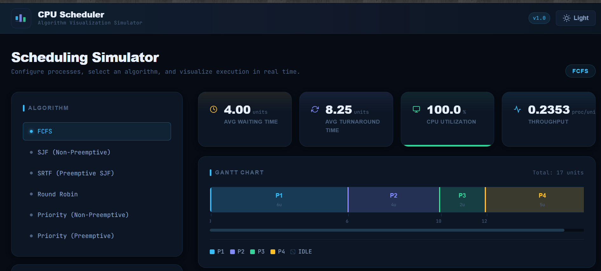
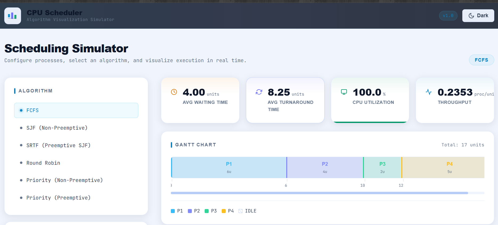
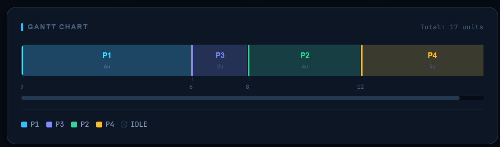
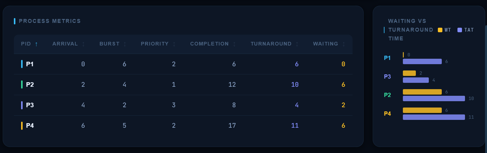

# CPU Scheduler Simulator

> An interactive, visual simulator for CPU scheduling algorithms — built with React + Vite, deployed on Vercel/Netlify.
> **Live:** [Try it on Vercel](https://cpu-scheduler-simulator-alpha.vercel.app/)
---

## Overview

CPU Scheduler Simulator is a fully client-side web application that visualizes how different CPU scheduling algorithms allocate processor time to processes. It computes and displays Gantt charts, per-process metrics (waiting time, turnaround time, completion time), and aggregate statistics (average WT, average TAT, CPU utilization, throughput) — all interactively in the browser.

**Designed for**: CS/CSE students, OS course revision, placement/internship portfolio projects, and anyone who wants to deeply understand process scheduling.

---

## Screenshots

| Dark Mode | Light Mode |
|-----------|------------|
|  | |

| Gantt Chart | Process Table |
|-----------|-----------|
|  |  |

---

## Features

- **6 Scheduling Algorithms** — FCFS, SJF (Non-Preemptive), SRTF, Round Robin, Priority (NP & P)
- **Interactive Gantt Chart** — scaled timeline with IDLE segments, tooltips, and color-coded processes
- **Per-Process Metrics Table** — sortable by any column; highlights WT and TAT
- **Aggregate Statistics Tiles** — Avg WT, Avg TAT, CPU Utilization (with progress bar), Throughput
- **Comparative Bar Chart** — side-by-side WT vs TAT visualization per process
- **Dark / Light Mode Toggle** — persisted in `localStorage`, respects OS preference
- **Process Presets** — load example process sets (Basic, Burst, Simultaneous) in one click
- **Input Validation** — meaningful error messages for all invalid inputs
- **Responsive Design** — works on desktop, tablet, and mobile
- **Zero Dependencies** — pure React + Vite; no chart library needed

---

## Project Structure

```
cpu-scheduler-sim/
├── public/
│   └── favicon.svg
├── src/
│   ├── algorithms/
│   │   └── index.js          # All 6 scheduling algorithm implementations
│   ├── components/
│   │   ├── Header/
│   │   │   ├── Header.jsx
│   │   │   └── Header.css
│   │   ├── AlgorithmSelector/
│   │   │   ├── AlgorithmSelector.jsx
│   │   │   └── AlgorithmSelector.css
│   │   ├── ProcessInput/
│   │   │   ├── ProcessInput.jsx
│   │   │   └── ProcessInput.css
│   │   ├── GanttChart/
│   │   │   ├── GanttChart.jsx
│   │   │   ├── GanttChart.css
│   │   │   ├── BarChart.jsx
│   │   │   └── BarChart.css
│   │   ├── MetricsCard/
│   │   │   ├── MetricsCard.jsx
│   │   │   └── MetricsCard.css
│   │   └── ProcessTable/
│   │       ├── ProcessTable.jsx
│   │       └── ProcessTable.css
│   ├── hooks/
│   │   ├── useScheduler.js   # Orchestration hook; calls algorithm functions
│   │   └── useTheme.js       # Dark/light theme persistence
│   ├── styles/
│   │   ├── global.css        # Design tokens, typography, layout utilities
│   │   └── App.css           # App-level layout styles
│   ├── App.jsx
│   └── main.jsx
├── index.html
├── vite.config.js
├── package.json
└── README.md
```

---

## Algorithms Explained

### 1. FCFS — First Come First Served
Non-preemptive. Processes are executed in order of arrival. Simple but can suffer from the **convoy effect** where short processes wait behind long ones.

### 2. SJF — Shortest Job First (Non-Preemptive)
Non-preemptive. Among available processes, the one with the shortest burst time is selected. Minimizes average waiting time among non-preemptive algorithms. May cause **starvation** of long processes.

### 3. SRTF — Shortest Remaining Time First (Preemptive SJF)
Preemptive version of SJF. When a new process arrives with a shorter remaining burst than the running process, it preempts the CPU. Optimal average waiting time but complex to implement.

### 4. Round Robin
Preemptive. Each process gets a fixed time quantum. After the quantum expires, the CPU is given to the next process in the ready queue. Fair allocation, widely used in time-sharing systems.

### 5. Priority Scheduling (Non-Preemptive)
Each process has a priority (lower number = higher priority). The highest-priority available process runs to completion. May lead to **starvation** of low-priority processes.

### 6. Priority Scheduling (Preemptive)
Preemptive version. When a higher-priority process arrives, it immediately preempts the current process. More responsive but more context-switch overhead.

---

## Metrics Explained

| Metric | Formula |
|--------|---------|
| **Completion Time (CT)** | Time at which process finishes execution |
| **Turnaround Time (TAT)** | CT − Arrival Time |
| **Waiting Time (WT)** | TAT − Burst Time |
| **CPU Utilization** | (Busy Time / Total Time) × 100% |
| **Throughput** | Number of processes / Total Time |

---

## Installation & Local Setup

### Steps

```bash
# 1. Clone the repository
git clone https://github.com/<your-username>/cpu-scheduler-sim.git
cd cpu-scheduler-sim

# 2. Install dependencies
npm install

# 3. Start development server
npm run dev
# → Open http://localhost:5173

# 4. Build for production
npm run build

# 5. Preview production build
npm run preview
```

---


## Future Enhancements

- [ ] **Multilevel Queue Scheduling** (MLQ)
- [ ] **Multilevel Feedback Queue** (MLFQ)
- [ ] **Animation mode** — step-through execution with timeline playback
- [ ] **Algorithm comparison mode** — run all algorithms on the same process set side-by-side
- [ ] **Export** — download Gantt chart as PNG, metrics as CSV
- [ ] **Process arrival animation** in Gantt timeline
- [ ] **Starvation detection** and aging simulation
- [ ] **Unit tests** with Vitest

---
## If the live demo is down You can still run it locally in under 2 minutes using the setup steps above.

---

*Built by Somya — feel free to reach out at [somyapatidar510@gmail.com](mailto:somyapatidar510@gmail.com) or connect on [LinkedIn](https://www.linkedin.com/in/somya-patidar2004/)*

